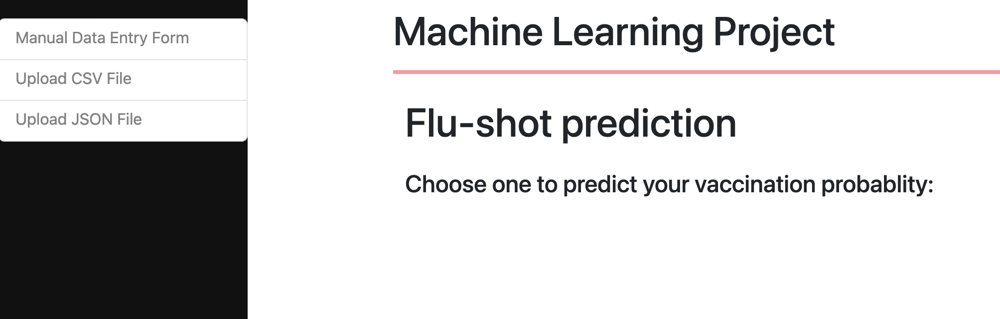
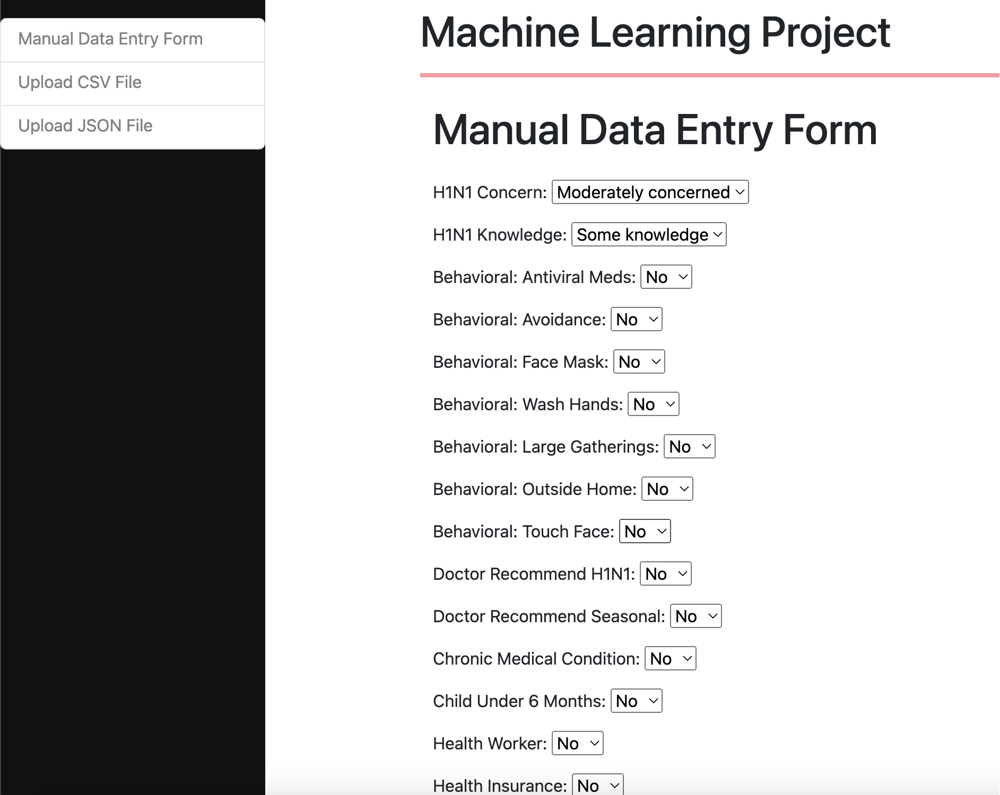
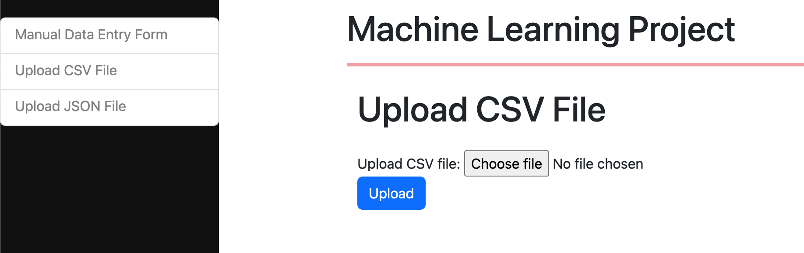

# Machine Learning Classification Models with Django and CI/CD Pipeline

## Table of Contents

- [Overview](#overview)
- [Machine Learning Models](#machine-learning-models)
- [Django Web Application](#django-web-application)
- [CI/CD Pipeline](#cicd-pipeline)
- [Installation](#installation)
- [Usage](#usage)
- [Results and Performance](#results-and-performance)
- [License](#license)
- [Contact](#contact)

## Overview
In this project I ahve implemented machine learning pipelines (CI/CD) for optimizing and training different
classification models.
</br>
I have used pandas for exploratory data analysis EDA_Flu_Shot.ipynb
</br>
The information including different models, the parameter space that the model will be optimized in 
and data that we will use for training and optimizing all are included in the src/trainin_config.py file.
</br>
after optimizng and training different classification models from sklearn including RandomForest, DecisionTress, SVC, different liear classification as well as Catboost classification the application save 
the models and the preprocessing pipelines that can be used in the main application.
</br>
The application also registers the models in mlflow with their preformances and moves the best model to the production stage that can be used in the main application in CD pipeline for prediction.
</br>
The CI pipeloine implemented in elasticbeanstalk AWS and using its CodePipeline service.
</br>
The serving application implemented using Django application where the application gets the features from different methods including Filling a form manualy, uploading CSV file or uploading Json file.
</br>

## Machine Learning Models

This project involves the creation and optimization of several classification models, including:

- **Logistic Regression**
- **Random Forest Classifier**
- **Support Vector Machine (SVM)**
- **XGBoost Classifier**
- **Cat Boost Classifier**
- **Gradient Boosting Classifier**
- **AdaBoost Classifier**
_ **...**

The models are trained and optimized on a dataset (./raw_data/training_set_features), using techniques such as hyperparameter tuning with GridSearchCV and cross-validation to ensure robust performance.

## Django Web Application

The machine learning models are served using a Django web application. The application provides a user-friendly interface where users can:

- Upload new data for prediction.
- View and download prediction results.
- Main application interface

- Manual feature filling interface

- CSV file uploading interface


### Key Features

- **Model Deployment**: Models are deployed using Django, allowing for easy integration and scalability 
where the models can be either loaded from saved models or using mlflow as the backend serving which ensures
CD pipleline is robust.
- **User Interface**: A responsive UI built with Django templates and Bootstrap.

## CI/CD Pipeline

The project employs a CI pipeline using CodePipeline of Amazone Web Serviece and CD pipeline using mlflow as back end serving server.


## Installation

To set up the project locally, follow these steps:

1. **Clone the repository**:

    ```bash
    git clone https://github.com/alrSasani/End_to_End_Flushot.git
    cd End_to_End_Flushot
    ```

2. **Create a virtual environment**:

    ```bash
    python -m venv venv
    source venv/bin/activate 
    ```

3. **Install the required dependencies**:

    ```bash
    python setup.py install
    ```

4. **Run migrations and start the Django server**:

    ```bash
    python application.py # this application file will train and optimize models and it might take some time depending of the models and paramter space provided in .src/training_config.py file in 
    ```

## Usage

- **Access the Web Interface**: Open a web browser and go to `http://127.0.0.1:8000/` to interact with the Django application.


## Results and Performance

The best-performing model was the **Cat Boost Classifier**, achieving an accuracy of 85% on the test set. 

## Contact

For any questions or inquiries, please contact:

- **Name**: Alireza Sasani
- **Email**: alr.sasani@gmail.com

---

